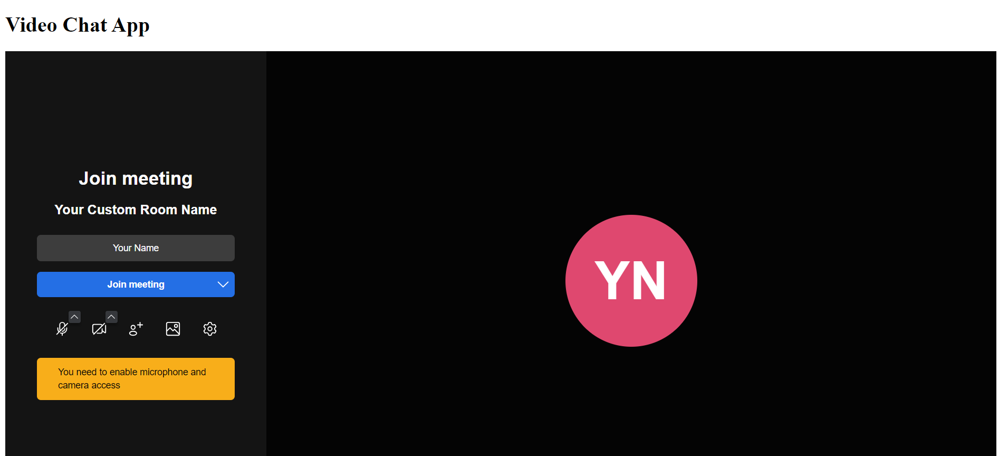

# Video Chat App



A simple video chat application built with React, TypeScript, Vite, and the Jitsi SDK. This app allows users to join a video chat room using Jitsi’s open-source video conferencing platform.

## Features

- Video chat using Jitsi’s free SDK.
- Customizable user interface with Tailwind CSS.
- React with TypeScript for clean, scalable code.
- Real-time video conferencing with room name configuration.

## Getting Started

### Prerequisites

Ensure you have the following installed:

- [Node.js](https://nodejs.org/) (version 14 or later)
- [npm](https://www.npmjs.com/) or [yarn](https://yarnpkg.com/)

### Installation

1. Clone the repository:
   ```bash
   git clone https://github.com/your-username/video-chat-app.git
   ```

2. Navigate to the project directory:
   ```bash
   cd video-chat-app
   ```

3. Install dependencies:
   ```bash
   npm install
   ```

4. Start the development server:
   ```bash
   npm run dev
   ```

5. Open the app in your browser at `http://127.0.0.1:5173`.

### Folder Structure

```
├── public
│   └── index.html           # HTML file for Vite
├── src
│   ├── components
│   │   └── VideoChat.tsx     # Jitsi video chat component
│   ├── App.tsx               # Main application file
│   ├── index.tsx             # Entry point for React
│   ├── main.tsx              # React with Vite
│   └── index.css             # Global CSS, includes Tailwind
├── package.json              # Dependencies and scripts
└── README.md                 # Project documentation
```

## Usage

1. Modify the room name in the `VideoChat.tsx` file:
   ```tsx
   <JitsiMeeting roomName="YourCustomRoomName" ... />
   ```

2. Update the user information with a display name and email:
   ```tsx
   userInfo={{
     displayName: 'Your Name',
     email: 'your.email@example.com'
   }}
   ```

3. Customize the video chat interface and configurations as needed.

## Technologies

- **React** with **TypeScript**
- **Vite** for fast builds and development
- **Jitsi SDK** for video conferencing
- **Tailwind CSS** for styling

## License

This project is licensed under the MIT License - see the [LICENSE](LICENSE) file for details.
